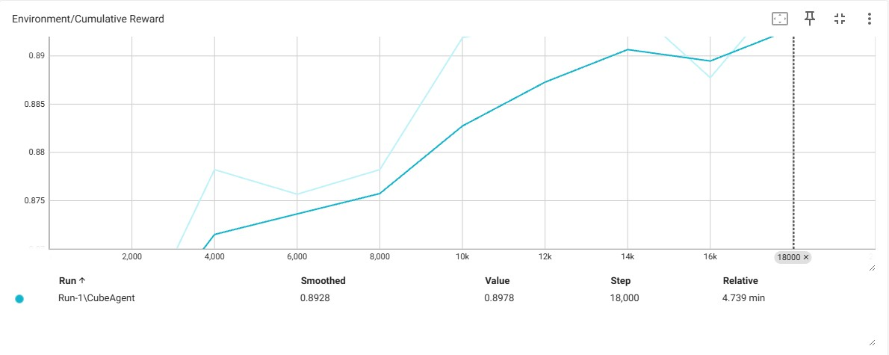

# Verslag – Zelflerende agent die obstakels ontwijkt

## Doel van de opdracht

Het doel van deze opdracht is om een zelflerende agent te maken die leert om bewegende obstakels te ontwijken door eroverheen te springen. Deze agent wordt getraind met behulp van reinforcement learning. Bij iedere episode beweegt een obstakel met een willekeurige snelheid richting de agent. De agent moet zelf leren wanneer hij moet springen om botsingen te vermijden.

Ik heb ervoor gekozen om deze uitbreiding te implementeren:

> **De agent wordt geconfronteerd met een rij van continu bewegende obstakels.**

---

## Werking

- De agent kan 2 acties uitvoeren: springen (`1`) of niets doen (`0`)
- Een obstakel vergroot constant in hoogte – dit gebeurt willekeurig
- De snelheid van het obstakel wordt aan het begin van elke episode willekeurig gekozen binnen een bepaald bereik

---

## Observatieruimte

De observatie wordt als een vector meegegeven aan het model en bevat:

- Y-positie van de agent (springstatus)
- X-positie van het obstakel
- Huidige snelheid van het obstakel

---

## Beloningsstructuur

| Situatie                      | Beloning |
| ----------------------------- | -------- |
| Obstakel geraakt              | -1       |
| Obstakel succesvol gesprongen | +1       |

---

## Analyse

- In het begin is de agent puur aan het gokken en krijgt hij vaak negatieve beloningen.
- Na enkele honderden episodes leert hij dat springen soms voordelig is.
- Rond de **1000–2000 episodes** stijgt de gemiddelde beloning duidelijk.
- Uiteindelijk leert de agent op een redelijk consistente manier obstakels te ontwijken.

---

## Evaluatie

Na de training is het model geëvalueerd op obstakels met nieuwe snelheden (binnen het trainingsbereik, maar met andere waardes dan tijdens training).

**Resultaat:**  
De agent kon in meer dan 90% van de gevallen succesvol springen en vermijden, ook bij hogere obstakel-snelheden.

**Visualisatie:**
Onderstaande TensorBoard-grafiek toont de evolutie van de episoderewards tijdens de training. We zien een duidelijke stijgende lijn, wat aangeeft dat het model steeds beter werd in het vermijden van obstakels.



---

## Reflectie en uitbreidingen

De agent presteert goed, maar de omgeving blijft vrij eenvoudig. Mogelijke uitbreidingen zijn:

- Meerdere obstakels tegelijk (rijen met meerdere timings)
- Willekeurige startposities of afstanden

---

## Tutorial – Zelf trainen en uitvoeren

### 1. Clone de repository

```bash
git clone https://github.com/AP-IT-GH/jumper-assignment-MilanMareels.git
cd obstakel-agent
```

### 2. (Optioneel) Maak en activeer een Conda-omgeving

```bash
conda create -n ml-agents python=3.8
conda activate ml-agents
```

### 3. Installeer de vereisten

```bash
pip3 install torch~=1.7.1 -f https://download.pytorch.org/whl/torch_stable.html
python -m pip install mlagents==0.30.0
pip install protobuf==3.20.*
pip install six
```

### 4. Open het Unity-project

1. Start Unity Hub
2. Klik op **"Open project"** en selecteer de map van deze repository
3. Wacht tot het project geladen is

### 5. Start de training

Gebruik het volgende commando:

```bash
mlagents-learn config/CubeAgent.yaml --run-id=TestRun --force
```

Wil je de training hervatten?

```bash
mlagents-learn config/CubeAgent.yaml --run-id=TestRun --resume
```

Klik in Unity op **Play** om de training te starten.

### 6. TensorBoard openen (optioneel)

Monitor de training live:

```bash
tensorboard --logdir results
```

Ga naar [http://localhost:6006](http://localhost:6006) in je browser om de voortgang te zien.
